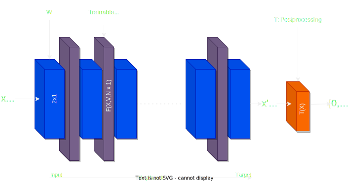

# Documentation

Most general model architecture:


___

## diffnet

### Class F_function_discrete
This class represents an activation function for fitting. It works by saving points in a parameterized array and performs interpolation to find the corresponding value based on the input.

Usage
```python
ff = F_function_discrete(points)
result = ff(x)
```

Parameters
- `points` (list of tuples): A list of tuples representing the force parameters. Each tuple consists of two values: the position and the force at that position.

Methods
- `__call__(self, x)`: Performs interpolation to find the force value at the given position x.


### Class F_percentage_function
This class is an advanced version of the `F_function_discrete` class. It also serves as an activation function for fitting and works by saving points in a parameterized array. It defines a domain with lower and upper limits and determines the number of points within that range. The interpolation is performed based on the percentage of the data point and selects the closest force point accordingly.

Usage
```python
ff = F_percentage_function(points, lower_limit, upper_limit, num_points)
result = ff(x)
```

Parameters
- `points` (list of tuples): A list of tuples representing the force parameters. Each tuple consists of two values: the position and the force at that position.
- `lower_limit` (float): The lower limit of the domain.
- `upper_limit` (float): The upper limit of the domain.
- `num_points` (int): The number of points within the domain.

Methods
- `__call__(self, x)`: Performs interpolation based on the percentage of the data point and selects the closest force point accordingly.

### Class W_matrix
This class represents a linear module that is not trainable. It defines weights and bias parameters and performs a linear transformation on the input.
Used to simulate the workings of a differential equation step.

Usage
```python
w = W_matrix(input_size, output_size)
result = w(x)
```

Parameters
- `input_size` (int): The size of the input tensor.
- `output_size` (int): The size of the output tensor.

Methods
- `__call__(self, x)`: Performs a linear transformation on the input tensor.

### Class T_postprocessing
This class is used for post-processing the output of the neural network. It compares the position coordinate of the input tensor with a specified value and returns 0 if it is within a given distance; otherwise, it returns 1.

Usage
```python
t_post = T_postprocessing(position_threshold)
result = t_post(x)
```

Parameters
- `position_threshold` (float): The distance threshold for post-processing.

Methods
- `__call__(self, x)`: Compares the position coordinate of the input tensor with the specified value and returns 0 if it is within the given distance; otherwise, returns 1.

### Class diffNet
 It takes parameters such as depth, lower limit, upper limit, dt (time step), ftype (activation function type), post_process (whether to apply post-processing), and debug (whether to enable debug mode). It creates an instance of the `W_matrix` class and initializes the activation function based on the specified type. It also includes a method to plot the force parameters.

Usage
```python
net = diffNet(depth, lower_limit, upper_limit, dt, ftype, post_process, debug)
result = net(input_tensor)
net.plot_parameters()
```

Parameters
- `depth` (int): The depth of the neural network.
- `lower_limit` (float): The lower limit of the force parameters.
- `upper_limit` (float): The upper limit of the force parameters.
- `dt` (float): The time step.
- `ftype` (str): The type of activation function. Valid options are "linear" or "percentage".
- `post_process` (bool): Whether to apply post-processing.
- `debug` (bool): Whether to enable debug mode.

Methods
- `__call__(self, x)`: Performs forward propagation on the input tensor.
- `plot_parameters(self)`: Plots the force parameters.

### Function smooth_loss

Usage
```python
loss = smooth_loss(parameters)
```

Parameters
- `parameters` (torch.Tensor): The parameters of the neural network.

Returns
- `loss` (torch.Tensor): The calculated loss for the smoothness of points.

### Function physics_constrain

Usage
```python
loss = physics_constrain(parameters)
```

Parameters
- `parameters` (torch.Tensor): The parameters of the neural network.

Returns
- `loss` (torch.Tensor): The calculated loss for the physics constraint.

### Main Execution
This section includes the main execution of the code. It imports additional modules such as dataset, torch, torch.nn, pandas, and matplotlib.pyplot. It initializes a dataset and dataloader, loads a pre-trained model, sets hyperparameters, defines a `loss function` (MSELoss), and an `optimizer` (SGD). It performs the training process by iterating over epochs and mini-batches, computing the loss, performing backward pass and optimization, and printing the statistics. It also saves the model and displays plots of the parameters and loss.

The main execution section of the code includes the following steps:

- Initialize the dataset and dataloader.
- Load the pre-trained model.
- Define hyperparameters such as smooth_rate, constrain_rate, targets_rate, and num_epochs.
- Define the loss function (L2_loss) and optimizer (optimizer).
- Perform the training loop, iterating over the dataloader batches.
- Save the trained model at regular intervals and plot the parameters and loss.
- Save the final trained model.
- Plot the parameters of the activation function after training.
- Plot the evolution of the L2 loss.

Please note that the code provided is a general outline, and you may need to modify it to suit your specific use case and dataset. Additionally, make sure to have the required imports and custom dataset and dataloader implementations for the code to run successfully.

___

## random_data_generation
This module provides functions for generating random data and running a time integrator. It includes functions for generating random initial conditions, integrating a differential equation numerically, and generating plots for data analysis.

### Function force_function(x, v):
Calculates the force function for a given position and velocity.

Parameters:
- x (float): The position value.
- v (float): The velocity value.

Returns:
- float: The force value.

### Function random_data_generation(Nsamples, Nlayers, dtime, xtol, force_function, xlim=(-1, 1), vlim=(-1, 1)):
Generates random data with random initial conditions and runs a time integrator.

Parameters:
- `Nsamples` (int): The number of samples to generate.
- `Nlayers` (int): The number of layers for the neural network.
- `dtime` (float): The time step for the integrator.
- `xtol` (float): Tolerance for the integrator.
- `force_function` (function): The force function to use for integration.
- `xlim` (tuple, optional): The limits for the position (default: (-1, 1)).
- `vlim` (tuple, optional): The limits for the velocity (default: (-1, 1)).

Returns:
- `pandas.DataFrame`: A DataFrame containing the generated data with columns ["xi", "vi", "xf", "vf"].

### Function generate_data(args, force_function, xlow=-10.0, xhigh=20.0, vlow=-5.0, vhigh=5.0):
Generates data based on the command-line arguments.

Parameters:
- `args` (argparse.Namespace): Command-line arguments.
- `force_function` (function): The force function to use for data generation.
- `xlow` (float, optional): The lower limit for position (default: -10.0).
- `xhigh` (float, optional): The upper limit for position (default: 20.0).
- `vlow` (float, optional): The lower limit for velocity (default: -5.0).
- `vhigh` (float, optional): The upper limit for velocity (default: 5.0).

Returns:
- `pandas.DataFrame`: A DataFrame containing the generated data with columns ["xi", "vi", "xf", "vf"].

### Function run_plots(data, xreal, epsilon, xlow, xhigh, vlow, vhigh, save_path=None):
 Generates plots for data analysis.

Parameters:
- `data` (pandas.DataFrame): The data to plot.
- `xreal` (float): The threshold value for classifying data.
- `epsilon` (float): The tolerance for classifying data.
- `xlow` (float): The lower limit for position.
- `xhigh` (float): The upper limit for position.
- `vlow` (float): The lower limit for velocity.
- `vhigh` (float): The upper limit for velocity.
- `save_path` (str, optional): The path to save the plots (default: None).

### Usage:
```python
from random_data_generation import random_data_generation, generate_data, main, run_plots

# Generate random data
data = random_data_generation(Nsamples, Nlayers, dtime, xtol, force_function, xlim=(-1, 1), vlim=(-1, 1))

# Generate data based on command-line arguments
args = parser.parse_args()
data = generate_data(args, force_function, xlow=-10.0, xhigh=20.0, vlow=-5.0, vhigh=5.0)

# Generate data and save to file
args = parser.parse_args()
total_data_frame = main(args, xlow=-10.0, xhigh=20.0, vlow=-5.0, vhigh=5.0)

# Generate plots for data analysis
run_plots(data, xreal, epsilon, xlow, xhigh, vlow, vhigh, save_path=None)
```

Make sure to import the necessary modules (integrate_data, numpy, matplotlib.pyplot, pandas, argparse) before using the functions from `random_data_generation.py.`

___

## postprocessor
This module provides functions for generating post processing data.

### Function narrow_gaussian(x, mu=0, sigma=0.01)
Approximation of Dirac delta function using a narrow Gaussian distribution.

Parameters:
- `x` (float): Input value.
- `mu` (float, optional): Mean of the Gaussian distribution (default: 0).
- `sigma` (float, optional): Standard deviation of the Gaussian distribution (default: 0.01).

Returns:
- `float`: The value of the narrow Gaussian distribution at the given input.

### Function post_process_data(data, xreal, epsilon)
Applies post-processing to the input data. using the narrow gaussian as a post processing function.

Parameters:
- `data` (pandas.DataFrame): The input data.
- `xreal` (float): Threshold value for classifying data.
- `epsilon` (float): Tolerance for classifying data.

Returns:
- `pandas.DataFrame`: The post-processed data with additional columns.

### Function p_run_plots(data, xreal, epsilon, force_function, save_path=None)
Generates plots for data analysis.

Parameters:
- `data` (pandas.DataFrame): The input data.
- `xreal` (float): Threshold value for classifying data.
- `epsilon` (float): Tolerance for classifying data.
- `force_function` (function): The force function used in data generation.
- `save_path` (str, optional): Path to save the plots (default: None).