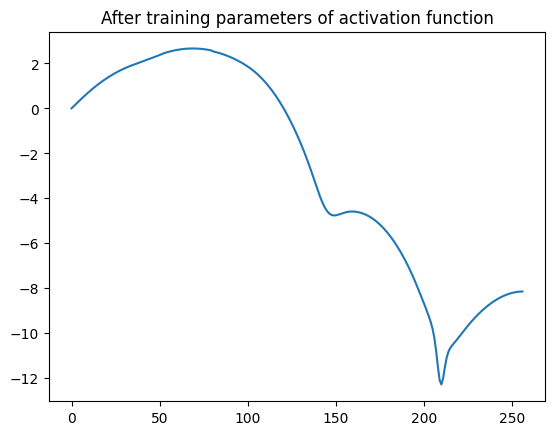
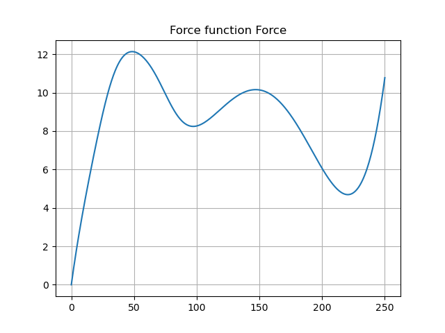

After training strange artiffacts appeared:


When the real function to be approximated is:


It was thought to be a bug of the loss functions or learning rate, but it completely blew the loss ammount;

Loss log:
```
L2_loss: 29.441688537597656    size of data: 50
 smoothing loss: 2.73
[Epoch 24, Mini-batch   100] Loss: 0.734
----
L2_loss: 26.167388916015625    size of data: 50
 smoothing loss: 2.54
[Epoch 24, Mini-batch   200] Loss: 0.631
----
L2_loss: 11.934471130371094    size of data: 50
 smoothing loss: 30.84
[Epoch 24, Mini-batch   300] Loss: 45501.228
----
L2_loss: 5.459011554718018    size of data: 50
 smoothing loss: 3.33
[Epoch 24, Mini-batch   400] Loss: 0.395
----
L2_loss: 0.4299149215221405    size of data: 50
 smoothing loss: 56.80
[Epoch 24, Mini-batch   500] Loss: 10070.621
```

Possibilities:
- generation of data
    - but the plots seem right 
- not having data points between some areas
    - the plots shows good coverage of `v` at the strange portions
- joining of data generated
    - exploring the cleaning function, theres a way of how the data is generated from the index, at some point at joining the csv files there could be a problem


## The answer:
Exploring, the data cleaning had a flaw; its was merged and then reworked; so at the point where to data sets collided, it could grab the end of one and the begining of another;

we can see that on position of the file `0405_song_f3.csv`
we have 209 as velocity then at the next time step we have 50; this causes the big downward spike

```csv
,x_initial,v_initial,x_step10,v_step10,x_step20,v_step20,x_step30,v_step30,x_step40,v_step40,x_step50,v_step50
14903,361.4710055748609,209.7902359267547,363.5691663197026,209.8415242912339,365.66783949272747,209.89277415821297,367.7670247100672,209.94398568959264,369.8667215895583,209.9951590473794,0.4504911182687815,50.10913527706431
14904,361.6807985791013,209.7953665002021,363.779010584084,209.8466510076488,365.8777349787864,209.89789703378065,367.9769713795105,209.94910474050897,0.0,50.0,0.5006063162330602,50.12126062447747

```

This was fixed reworking the `clean_data.py` script; first